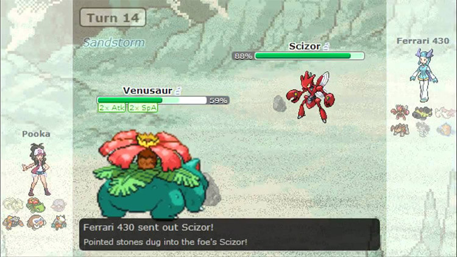

# POKEBATTLE_COMPILER



O objetivo desse projeto é implementar uma linguagem de programação capaz de simular batalhas pokemons. Assim como simuladores famosos como pokemon showdown [https://play.pokemonshowdown.com/], um dos principais objetivos é tornar possível o treino para batalhas competitivas sem a necessidade de outros jogares, apenas simulando estratégias.

Uma apresentação sobre a linguagem pode ser acessada no link a seguir: [clique aqui](https://www.canva.com/design/DAFlo3A9Dmc/4UswNXZCTWYhu-jiVRHO7A/edit?utm_content=DAFlo3A9Dmc&utm_campaign=designshare&utm_medium=link2&utm_source=sharebutton)

## Como utilizar

Para utilizar a linguagem, é importante utilizar o compiler.py presente no repositório. Assim, basta criar um arquivo com o código escrito em POKEBATTLE seguindo a EBNF da linguagem e rodar o script do compilador passando o caminho do arquivo de texto como entrada.

## EBNF da linguagem


```
program = { statement } ;

statement = atributes_declaration
          | tipo_declaration
          | bin_op
          | assign
          | while_block
          | if_block
          | func_declaration
          | funcall ;

atributes_declaration = VAR_NAME DOUBLE_ARROW ATRIBUTE_INT ASSIGN NUMBER ;

tipo_declaration = VAR_NAME DOUBLE_ARROW ATRIBUTE_STR ASSIGN ASPAS STRING ASPAS ;

bin_op = VAR_NAME BINOP VAR_NAME ;

bool_op = VAR_NAME BOOL_OP NUMBER ;

assign = VAR_NAME ASSIGN bin_op ;

while_block = WHILE bool_op QUEBRA program END ;

if_block = IF bool_op QUEBRA program END ;

func_declaration = FUNC_DEC VAR_NAME OPEN_PAREN func_params CLOSE_PAREN func_return_block END ;

func_params = VAR_NAME SEMI_ARROW VAR_NAME { VIRGULA VAR_NAME SEMI_ARROW VAR_NAME } ;

func_return_block = program RETURN VAR_NAME ;

funcall = VAR_NAME ASSIGN VAR_NAME OPEN_PAREN funcall_params CLOSE_PAREN ;

funcall_params = VAR_NAME { VIRGULA VAR_NAME } ;

VIRGULA ::= , ;
VARNAME ::= [a-zA-Z]+_[a-zA-Z]+ ;
ASSIGN  ::= IGUAL ;
ATRIBUTE_INT ::= HP|ATAQUE ;
BOOL_OP ::= MAIOR|MENOR|EXATO ;
IF ::= SE ;
NUMBER ::= \d+ ;
NUMBER ::= digit { digit } ;
digit ::= 0 | 1 | 2 | 3 | 4 | 5 | 6 | 7 | 8 | 9 ;
ATRIBUTE_STR ::= TIPO ; 
QUEBRA ::= \n ;
BINOP ::= RECUPERAR|ATACAR|* ;
END ::= FIM_TATICA ;
WHILE ::= BATALHA ;
RETURN ::= RESULTADO ; 
ASPAS ::= " ;
OPEN_PAREN ::= ( ;
CLOSE_PAREN ::= ) ;
DOUBLE_ARROW ::= >> ;
SEMI_ARROW ::= => ;
FUNC_DEC ::= ESTRATEGIA ;
STRING ::= [A-Z]+;
```

## Exemplo de código
A linguagem desenvolvida permite o desenvolvimento de LOOPs, operações binárias, condicionais, operações aritméticas, declarações de função e de variáveis. Todas as operações de batalha, como RECUPERAR HP ou Atacar outro pokemon funcionam como operações aritméticas em outras linguagens.

O arquivo abaixo representa o test_case_5.jl, presente no repositório. Também há outros testes no repositório para verificar o funcionamento individual das partes da linguagem.

```
pikachu_hp>>HP IGUAL 80
pikachu_attack>>ATAQUE IGUAL 18
pikachu_tipo>>TIPO IGUAL "ELETRICO"

mimikyu_hp>>HP IGUAL 60
mimikyu_attack>>ATAQUE IGUAL 30
mimikyu_tipo>>TIPO IGUAL "FANTASMA"

max_potion>>ITEM IGUAL 50
super_potion>>ITEM IGUAL 30

mimikyu_hp IGUAL pikachu_attack ATACAR mimikyu_hp
pikachu_hp IGUAL mimikyu_attack ATACAR pikachu_hp

ESTRATEGIA estrategia_base(pokemon_hp=>HP, item_name=>ITEM) HP
    SE pokemon_hp MENOR 30
        pokemon_hp IGUAL item_name RECUPERAR pokemon_hp 
    FIM_TATICA

    RESULTADO pokemon_hp
FIM_TATICA

BATALHA mimikyu_hp MAIOR 0
    pikachu_hp IGUAL estrategia_base(pikachu_hp, max_potion)
    mimikyu_hp IGUAL pikachu_attack ATACAR mimikyu_hp
    pikachu_hp IGUAL mimikyu_attack ATACAR pikachu_hp
FIM_TATICA
  
```

Saída esperada:

```
pikachu atacou mimikyu
mimikyu perdeu 18 de HP
mimikyu atacou pikachu
pikachu perdeu 30 de HP
pokebattle iniciada!
pikachu atacou mimikyu
mimikyu perdeu 18 de HP
mimikyu atacou pikachu
pikachu perdeu 30 de HP
trainer utilizou item_name
pokemon recuperou 50 de HP
pikachu atacou mimikyu
mimikyu perdeu 18 de HP
mimikyu atacou pikachu
pikachu perdeu 30 de HP
pikachu atacou mimikyu
mimikyu perdeu 18 de HP
mimikyu atacou pikachu
pikachu perdeu 30 de HP
mimikyu desmaiou!
```

**OBS** Existem outros testes no repositório! Sinta-se à vontade para testá-los ou criar as suas próprias batalhas!
